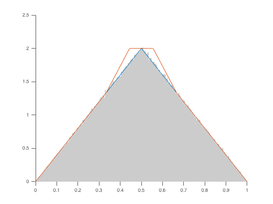

# LipSample
MATLAB code to generate random variates following arbitrary Lipschitz continuous densities on the interval.

## Example

Sample from the normal distribution (Lipschitz constant 0.25) restricted to [-5, 5].

```matlab
sample = lipsample(@normpdf, 0.25, [-5 5], 10000000);
```
Plot the result.

```matlab
pretty_hist(sample, [-5 5]);
```


## Usage and functionalities

`sample = lipsample(@f, L, [a b], m);` Draws a sample of size _m_ from the probability density function _f_ which is Lipschitz continuous of order _L_ on _[a,b]_. For large _m_, samples are drawn from a piecewise linear approximation of _f_ at distance at most 0.0005 in the supremum norm. Exact samples or different error tolerances can be obtained by using the 'Tolerance' key.

`sample = lipsample(@f, L, [a b], m, 'Tolerance', epsilon);` ... If _epsilon_ = 0, exact samples are drawn for all sample sizes. Otherwise, for large _m_, samples are drawn from a piecewise linear approximation of _f_ at distance less than _epsilon_ in the supremum norm.

## Notes
The function _f_ does not have to be a normalized density, but it should be scaled to be near 1 as to improve efficiency. _L_ is the Lipschitz constant of _f_, not of its renormalization.

Below you can see the envelope that was automatically constructed for the acceptance-rejection sampling of a triangular density (`lipsample(@triangular, 4, [0 1], 1000000, 'N', 9);`).


